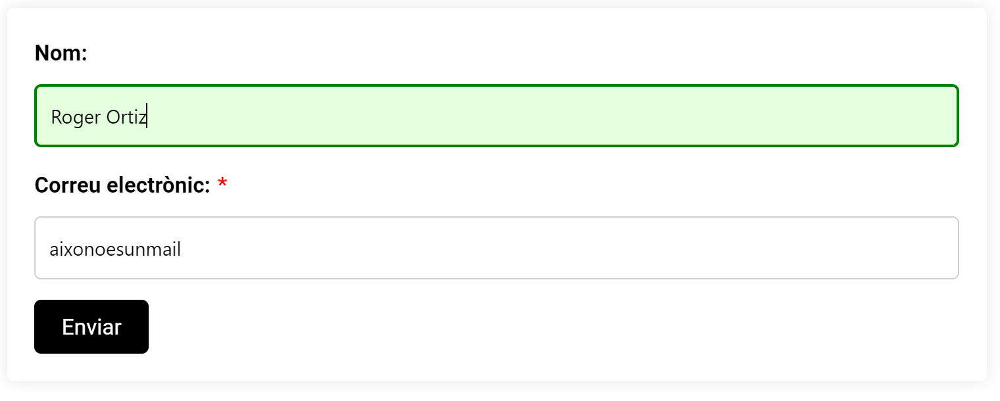

= Subasterra: Memòria del projecte

toc::[]

== 1. Introducció

En aquest apartat s'explicarà el propòsit del projecte, es descriuran els membres de l'equip de treball, les necessitats dels usuaris i els objectius del projecte.

Aquest projecte ha estat realitzat per tres alumnes de Grau Superior de Desenvolupament d'Aplicacions Web de l'Institut Nicolau Copèrnic de Terrassa.
****
* https://gitlab.com/ortiz.leal.roger[**Roger Ortiz Leal**] (`ortiz.leal.roger@alumnat.copernic.cat`)

* https://gitlab.com/gonzalez.guix.ramon[**Ramón González Guix**] (`gonzalez.guix.ramon@alumnat.copernic.cat`)

* https://gitlab.com/ibenitez[**Ismael Benítez Martínez**] (`ibenitez@alumnat.copernic.cat`)
****

L’objectiu principal de l’aplicació és oferir una plataforma en línia per gestionar subhastes físiques de petit format.

La Casa de Subhastes busca facilitar la interacció entre compradors, venedors i subhastadors, per tal de permetre als usuaris explorar i participar en subhastes d’una forma còmoda i eficient.

La plataforma respon a les següents necessitats:

- **Usuaris no registrats**: Permetre’ls explorar les sessions de subhasta programades i consultar la informació dels productes sense necessitat de registre.
- **Usuaris registrats**: Facilitar la pujada i gestió de productes per subhastar, així com el seguiment de l’estat d’aquests productes en temps real.
- **Subhastadors**: Proporcionar una eina de gestió de sessions, validació de productes i administració de transaccions econòmiques de forma centralitzada.

== 2. Disseny de bases de dades
* https://drive.google.com/file/d/1Y18KrAgeyOQ7Dl8aT-LCpGar8g0uD_9X/view?usp=sharing[**Diagrama de bases de dades**]

== 3. Skeitching d'interfícies

== 4. La guia d’estil
=== Paleta de colors

La idea es fer un disseny minimalista amb fons **blanc** i la tipografia de color **negre**. La idea es fer ús del **gris** per donar volum a la  pàgina web i fer ús d'una paleta de colors **vermells** per resaltar elements.

=== Tipografia

image::images_guide/logo.png[Logo,link=https://gitlab.com/ortiz.leal.roger/subasterra/-/blob/develop/docs/styles_guide/logo.html,width=250,height=250]

[source, css]
----
{
    font-family: Cinzel;
    font-size: 24px;
}
----

[source, css]
----
{
    font-family: Roboto;
    font-size: 16px;
}
----

[source, css]
----
{
    font-family: Montserrat;
    font-size: 16px;
    text-transform: uppercase;
}
----

[source, css]
----
{
    font-family: Roboto;
    font-size: 22px;
}
----

=== Iconografía:
Utilitzarem la iconografia que ofereix __Google Fonts__. Farem ús sempre que sigui necessari per donar informació a l'usuari. Si hi ha un menú per fer cerques colocarem l'icono __Search__, si fem ús de display __Keyboard Arrow Down__, per tancar finestres __Close__, entre altres...

=== Botons:
==== Botons amb crida a l'acció:

=== Enllaços:
==== Enllaços de navegació:

image::images_guide/links.png[Links,link=https://gitlab.com/ortiz.leal.roger/subasterra/-/blob/develop/docs/styles_guide/links_prototype_1.html,width=250,height=250]

=== Elements de formulari:

=== Altres components:

Pendent de definir.

== 5. Confecció del manual d’instal·lació/distribució de l’aplicació
=== Desplegament

Per desplegar l'aplicació, hem utilitzar IsardVDI. Hem configurat dos servidors, un per a desenvolupament i un altre per a producció:

* **Desenvolupament** (Roger Ortiz Leal): `192.168.50.154`
* **Producció** (Ismael Benítez Martínez): `192.168.50.153`

El servidor de producció utilitza la branca `main` del repositori, mentre que el servidor de desenvolupament utilitza la branca `development`.

Addicionalment, hem configurat el servidor de desenvolupament amb el major nombre d'opcions de depuració possibles per facilitar el desenvolupament.

Tot aquest procés l'hem automatitzat amb un script de desplegament que es pot trobar a la carpeta `scripts` del repositori.

Per veure com configurar un entorn de desenvolupament i desplegament a IsardVDI, seguiu les instruccions següents.

=== Client de desenvolupament

==== Configuració prèvia de la màquina virtual
Abans de començar a treballar amb el servidor, realitzarem unes configuracions prèvies a la màquina virtual:

1. Actualitzem els paquets del sistema amb la comanda `sudo apt update`.

2. Farem que se li assigni una IP al servidor amb la comanda `sudo dhclient`.

3. Canviarem el `hostname` de la màquina virtual amb `sudo hostnamectl set-hostname dev-client`.

4. Aparentment, després de canviar el `hostname`, el canvi no es reflecteix a l'arxiu `/etc/hosts` i cada cop que executem `sudo` ens apareix un missatge d'error. Per solucionar-ho, podem utilitzar `sed` per canviar el `hostname` antic pel nou: `sudo sed -i 's/hostname-antic/dev-client/g' /etc/hosts`.

5. Finalment, reiniciarem la màquina amb `sudo reboot`.

==== Instal·lació del servidor SSH

Per poder connectar-nos de forma remota a les màquines virtuals, necessitem instal·lar un servidor SSH:

1. Instal·lem el servidor SSH amb la comanda `sudo apt install openssh-server`.

2. Un cop instal·lat, iniciem el servei amb la comanda `sudo systemctl start ssh`.

3. Per comprovar que el servei s'ha iniciat correctament, executem `sudo systemctl status ssh`.

4. Si ho hem fet tot correctament, veurem un missatge semblant a aquest:

[source, bash]
----
● ssh.service - OpenBSD Secure Shell server
     Loaded: loaded (/lib/systemd/system/ssh.service; enabled; preset: enabled)
     Active: active (running) since Tue 2024-10-08 15:48:36 CEST; 1h 42min ago
       Docs: man:sshd(8)
             man:sshd_config(5)
   Main PID: 493 (sshd)
      Tasks: 1 (limit: 2315)
     Memory: 8.4M
        CPU: 122ms
     CGroup: /system.slice/ssh.service
             └─493 "sshd: /usr/sbin/sshd -D [listener] 0 of 10-100 startups"
----

==== Configuració de la xarxa (client)
La màquina està configurada amb 3 interficies de xarxa. 2 d’elles es configuren automàticament per DHCP i una altra ha de ser manual.

Per la configuració manual, haurem d’assignar a la nostra màquina la IP que se'ns ha assignat. Per fer-ho, seguirem els següents passos:

* Com que utilitzarem netplan, crearem un arxiu de configuració amb `sudo nano /etc/netplan/01-netcfg.yaml`.

=== Servidor de desenvolupament

==== Configuració prèvia de la màquina virtual
Abans de començar a treballar amb el servidor, realitzarem unes configuracions prèvies a la màquina virtual:

1. Actualitzem els paquets del sistema amb la comanda `sudo apt update`.

2. Farem que se li assigni una IP al servidor amb la comanda `sudo dhclient`.

3. Canviarem el `hostname` de la màquina virtual amb `sudo hostnamectl set-hostname dev-server`.

4. Aparentment, després de canviar el `hostname`, el canvi no es reflecteix a l'arxiu `/etc/hosts` i cada cop que executem `sudo` ens apareix un missatge d'error. Per solucionar-ho, podem utilitzar `sed` per canviar el `hostname` antic pel nou: `sudo sed -i 's/hostname-antic/dev-server/g' /etc/hosts`.

5. Finalment, reiniciarem la màquina amb `sudo reboot`.

==== Instal·lació del servidor SSH
Per poder connectar-nos de forma remota a les màquines virtuals, necessitem instal·lar un servidor SSH:

1. Instal·lem el servidor SSH amb la comanda `sudo apt install openssh-server`.

2. Un cop instal·lat, iniciem el servei amb la comanda `sudo systemctl start ssh`.

3. Per comprovar que el servei s'ha iniciat correctament, executem `sudo systemctl status ssh`.

4. Si ho hem fet tot correctament, veurem un missatge semblant a aquest:
[source, bash]
----
● ssh.service - OpenBSD Secure Shell server
     Loaded: loaded (/lib/systemd/system/ssh.service; enabled; preset: enabled)
     Active: active (running) since Tue 2024-10-08 15:48:36 CEST; 1h 42min ago
       Docs: man:sshd(8)
             man:sshd_config(5)
   Main PID: 493 (sshd)
      Tasks: 1 (limit: 2315)
     Memory: 8.4M
        CPU: 122ms
     CGroup: /system.slice/ssh.service
             └─493 "sshd: /usr/sbin/sshd -D [listener] 0 of 10-100 startups"
----

==== Instal·lació d'Apache2
Per poder desplegar la nostra aplicació, necessitem un servidor web. En aquest cas, utilitzarem Apache:

1. Instal·lem Apache amb la comanda `sudo apt install apache2`.

2. Un cop instal·lat, iniciem el servei amb la comanda `sudo systemctl start apache2`.

3. El següent pas és configurar el firewall per permetre el tràfic HTTP (i HTTPS, si és necessari). Per fer-ho, executem `sudo ufw allow 'WWW Secure'`.

4. Per comprovar que el servei s'ha iniciat correctament, executem `sudo systemctl status apache2`.

5. Si ho hem fet tot correctament, veurem un missatge semblant a aquest:
[source, bash]
----
● apache2.service - The Apache HTTP Server
     Loaded: loaded (/lib/systemd/system/apache2.service; enabled; preset: enabled)
     Active: active (running) since Tue 2024-10-08 15:48:37 CEST; 1h 42min ago
       Docs: https://httpd.apache.org/docs/2.4/
   Main PID: 494 (apache2)
      Tasks: 55 (limit: 2315)
     Memory: 11.8M
        CPU: 388ms
     CGroup: /system.slice/apache2.service
             ├─494 /usr/sbin/apache2 -k start
             ├─495 /usr/sbin/apache2 -k start
             └─496 /usr/sbin/apache2 -k start
----

==== Instal·lació de PHP (8.2)
TIP: Pots consultar https://php.watch/articles/install-php82-ubuntu-debian[**aquesta guia**] per obtenir insutrccions més detallades (en anglès).

Per poder fer funcionar el backend de la nostra aplicació, necessitem PHP:

1. Instal·lem les dependències necessàries amb la comanda `sudo apt install apt-transport-https lsb-release ca-certificates software-properties-common python3-launchpadlib`.

2. Descarreguem i instal·lem `libicu70` amb `wget http://ftp.osuosl.org/pub/ubuntu/pool/main/i/icu/libicu70_70.1-2_amd64.deb && sudo dpkg -i libicu70_70.1-2_amd64.deb`.

3. Afegim el repositori de PHP amb la comanda `sudo add-apt-repository ppa:ondrej/php`.

4. Actualitzem els paquets amb `sudo apt update`.

5. Instal·lem PHP 8.2 amb la comanda `sudo apt install php8.2 php8.2-cli php8.2-{bz2,curl,mbstring,intl}`.

==== Configuració de PHP
Per defecte, PHP no està configurat per funcionar amb Apache. Per solucionar-ho, necessitem instal·lar el mòdul de PHP per Apache:

1. Instal·lem el mòdul amb la comanda `sudo apt install libapache2-mod-php8.2`.

2. Activen el mòdul amb `sudo a2enmod php8.2` i reiniciem Apache amb `sudo systemctl restart apache2`.

3. Per comprovar que PHP està funcionant correctament, crearem un arxiu `info.php` a la carpeta `/var/www/html` amb el següent contingut i accedirem a `http://dev-server/info.php` des d'un navegador. Si tot ha anat bé, hauríem de veure una pàgina amb la informació de PHP:
[source, php]
----
<?php
phpinfo();
----

==== Instal·lació de MariaDB
Per poder emmagatzemar les dades de la nostra aplicació, hem decidit optar per MariaDB ja que és una opció senzilla de configurar amb PHP:

1. Instal·lem MariaDB amb la comanda `sudo apt install mariadb-server`.

2. Un cop instal·lat, iniciem el servei amb la comanda `sudo systemctl start mariadb`.

3. Per comprovar que el servei s'ha iniciat correctament, executem `sudo systemctl status mariadb`.

4. Si ho hem fet tot correctament, veurem un missatge semblant a aquest:
[source, bash]
----
● mariadb.service - MariaDB 10.11.6 database server
     Loaded: loaded (/lib/systemd/system/mariadb.service; enabled; preset: enabled)
     Active: active (running) since Tue 2024-10-08 17:38:11 CEST; 8s ago
       Docs: man:mariadbd(8)
             https://mariadb.com/kb/en/library/systemd/
   Main PID: 14169 (mariadbd)
     Status: "Taking your SQL requests now..."
      Tasks: 13 (limit: 2315)
     Memory: 86.0M
        CPU: 264ms
     CGroup: /system.slice/mariadb.service
             └─14169 /usr/sbin/mariadbd
----

==== Configuració de MariaDB
Un cop tenim MariaDB instal·lat, necessitem configurar-lo per poder començar a treballar amb ell:

1. Executem la comanda `sudo mysql_secure_installation` per configurar la seguretat de la base de dades.

2. Se'ns demanarà que canviarem la contrasenya de l'usuari `root`, en aquest cas, la deixarem en blanc.

3. A continuació, se'ns demanarà si volem canviar la contrasenya `root` per a MariaDB. Nosaltres li direm que no (`N`).

4. Després, simplement prem `Y` i `Enter` per a les següents preguntes (per acceptar les opcions per defecte).

5. Finalment, reiniciem el servei amb `sudo systemctl restart mariadb`.

6. Un cop reiniciat, accedim a la consola de MariaDB amb `sudo mysql -u root`.

7. Crearem un nou usuari amb permisos d'administrador per poder treballar amb la base de dades fent servir `GRANT ALL ON *.* TO 'admin'@'localhost' IDENTIFIED BY 'password1234!' WITH GRANT OPTION;`

8. Fem servir `FLUSH PRIVILEGES;` per aplicar els canvis i sortim de la consola amb `exit`.

9. Per comprovar que tot ha anat bé, podem tornar a accedir a la consola de MariaDB amb `sudo mysql -u admin -p` i introduir la contrasenya que hem definit abans.

==== Configuració de la xarxa (servidor)
La màquina està configurada amb 3 interficies de xarxa. 2 d’elles es configuren automàticament per DHCP i una altra ha de ser manual.

Per la configuració manual, haurem d’assignar a la nostra màquina la IP que se'ns ha assignat. Per fer-ho, seguirem els següents passos:

* `sudo nano /etc/network/interfaces` i dintre de l'arxiu, a sota de la linia `# The primary network interface` afegirem el següent:
[source, bash]
----
auto enp2s0
auto enp3s0

allow-hotplug enp1s0
iface enp1s0 inet dhcp
iface enp2s0 inet dhcp
iface enp3s0 inet static
        address 192.168.50.xxx 
        netmask 255.255.255.0
----

* Un cop afegit, guardem l'arxiu i sortim de l'editor (`Ctrl + X`, `Y` i `Enter`).

* Seguidament, reiniciarem la màquina amb la comanda `sudo reboot`.

* Un cop reiniciada, comprovarem que la IP s'ha assignat correctament amb `ip a`.

==== Desplegament de l'aplicació
Per desplegar l'aplicació, hem utilitzar l'script de desplegament que es pot trobar a la carpeta `scripts` del repositori:

1. Instal·lem `git` amb la comanda `sudo apt install git`.

2. Configurem les claus SSH seguint les instruccions de la guia oficial de GitHub: https://docs.github.com/en/github/authenticating-to-github/connecting-to-github-with-ssh[**Connecting to GitHub with SSH**].

3. Clonem el repositori amb la comanda `git clone git@gitlab.com:ortiz.leal.roger/subasterra.git`.

4. Un cop clonat, entrem a la carpeta del repositori amb `cd subasterra`.

5. Finalment, executem l'script de desplegament amb `bash scripts/deploy.sh desenvolupament`. Si volem desplegar l'aplicació en producció, canviarem `desenvolupament` per `produccio`.

==== Desenvolupament local
Per poder treballar en l'aplicació de forma local, necessitem tenir un entorn de desenvolupament configurat:

1. Clonem aquest repositori o, si ja ho hem fet, actualitzem-lo amb `git pull` i ens movem a la carpeta de DDBB amb `cd ddbb` (dins del repositori).

2. Si volem començar de zero, borrem totes les màquines de Vagrant prèviament creades amb `.\reset.bat`.

3. Seguidament, posem en marxa la màquina virtual amb `vagrant up`.

4. Un cop finalitzat, ens assegurem que la base de dades està sincronitzada amb la màquina virtual amb `vagrant ssh default -c "fetchdb"`.

5. Finalment, ens movem a la carpeta arrel del repositori amb `cd ..` i posem en marxa el servidor PHP amb `php -S localhost:8000`.

6. Si tot ha anat bé, podrem accedir a l'aplicació a `http://localhost:8000`.

== 6. Confecció del manual d’usuari

== 7. Línies futures

== 8. Conclusions

== 9. Webgrafia